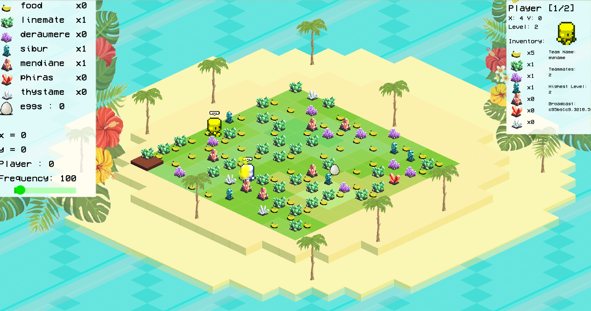

# Zappy

**ZAPPY – A Tribute to Zaphod Beeblebrox** is a multiplayer network game in which teams of autonomous agents ("Trantorians") compete on a toroidal grid (edges wrap around) to gather resources and level up through a cooperative elevation ritual. The first team to promote at least **6 players** to **level 8** wins the match.



---

## 📋 Table of Contents

1. [Features](#-features)
2. [Prerequisites](#-prerequisites)
3. [Installation](#-installation)
4. [Building](#-building)
5. [Running](#-running)
6. [Project Structure](#-project-structure)
7. [Network Protocol](#-network-protocol)
8. [Dependencies](#-dependencies)
9. [Authors](#-authors)

---

## 🚀 Features

* **Server (`zappy_server`)**: Implements world simulation in C, manages resource spawning, agent actions, and game logic using non-blocking I/O (`poll`).
* **Graphical Client (`zappy_gui`)**: C++ application (SFML-based) that visualizes the game world in real time.
* **AI Client (`zappy_ai`)**: Autonomous agent controller in any language, following the project protocol to interact with the server.
* **Toroidal Map**: World edges wrap around seamlessly.
* **Elevating Ritual**: Cooperative leveling mechanic requiring players to gather specific resources and synchronize actions.

---

## 🔧 Prerequisites

Ensure you have the following installed on your system:

```bash
sudo apt update
sudo apt install -y build-essential cmake pkg-config libsfml-dev
```

* **build-essential** (GCC, g++, make)
* **CMake** (≥ 3.10)
* **SFML** (Simple and Fast Multimedia Library) for the GUI
* **pkg-config**

---

## 🛠️ Installation

Clone the repository and navigate into it:

```bash
git clone https://github.com/YourOrg/zappy.git
cd zappy
```

---

## 🏗️ Building

We use CMake for cross-platform builds. From the project root:

```bash
mkdir build && cd build
cmake ..
make            # builds all targets: zappy_server, zappy_gui, zappy_ai
make clean      # remove build artifacts
make reinstall  # clean + build
```

---

## ▶️ Running

Start each component in its own terminal:

1. **Server**

   ```bash
   ./zappy_server -p <port> -x <width> -y <height> -n TeamA TeamB ... -c <clients_per_team> -f <frequency>
   ```
2. **Graphical Client**

   ```bash
   ./zappy_gui -p <port> -h <server_host>
   ```
3. **AI Client**

   ```bash
   ./zappy_ai -p <port> -n <team_name> -h <server_host>
   ```

*Use `-h` or `--help` with any binary for detailed usage.*

---

## 📂 Project Structure

```
zappy/
├── CMakeLists.txt
├── server/
│   ├── main.c
│   ├── …
│   └── zappy_server (output)
├── gui/
│   ├── main.cpp
│   ├── …
│   └── zappy_gui (output)
├── ai/
│   ├── ai_client.*
│   └── zappy_ai (output)
├── docs/
│   └── PROTOCOL.md
└── images/
    └── zappyGui.png
```

---

## 🌐 Network Protocol

The game uses a custom text-based TCP protocol to communicate between server and clients. All messages end with `\n`. Key phases:

1. **Handshake**:

   * Server: `WELCOME\n`
   * Client: `<TEAM_NAME>\n`
   * Server: `CLIENT_NUM\n` (available slots) and `X Y\n` (map size)
2. **Commands**:

   * Movement: `Forward`, `Right`, `Left`
   * Interaction: `Look`, `Inventory`, `Take <object>`, `Set <object>`
   * Communication: `Broadcast <message>` → `message <dir>,<text>`
   * Ritual: `Incantation` → success/failure responses
   * …

Refer to [`docs/PROTOCOL.md`](docs/PROTOCOL.md) for full command definitions and timing rules.

---

## 📦 Dependencies

* **C (Server)**: Standard library, POSIX sockets, `poll()`
* **C++ (GUI)**: SFML, threading, JSON (for message parsing)
* **AI Client**: Any language supporting TCP sockets (reference in Python included)

---

## 👩‍💻 Authors

* **Anaïs Parenti** — [GitHub](https://github.com/ananasparenti)
* **Adrien Marette** — [GitHub](https://github.com/Adrien-Marette)
* **Ridjan Xhika** — [GitHub](https://github.com/ridjan-xhika)
* **Gabriel Mchiri** — [GitHub](https://github.com/Gabrie15066)
* **Sara Himmich** — [GitHub](https://github.com/Sara28himmich)

---
