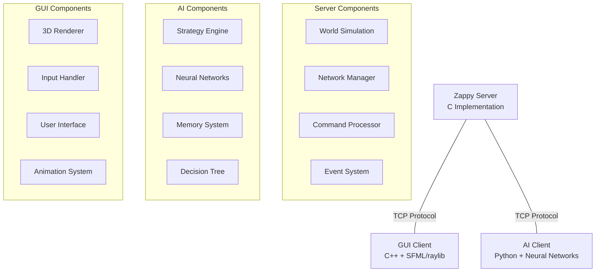

# Zappy Documentation


Welcome to the comprehensive documentation for **Zappy** - a multiplayer network game where teams of autonomous agents compete to gather resources and level up through cooperative elevation rituals.

## What is Zappy?

**Zappy** is a tribute to Zaphod Beeblebrox from *The Hitchhiker's Guide to the Galaxy*. In this game, teams of autonomous "Trantorians" compete on a toroidal grid (where edges wrap around) to gather resources and evolve. The objective is simple yet challenging: **be the first team to promote at least 6 players to level 8**.


## 🎯 Key Features

<div class="feature-cards">

<div class="feature-card">
<h3>🖥️ Server Component</h3>
High-performance C implementation with non-blocking I/O using <code>poll()</code>. Manages world simulation, resource spawning, and game logic in real-time.
</div>

<div class="feature-card">
<h3>🎨 3D GUI Client</h3>
Beautiful C++ application powered by SFML/raylib that visualizes the game world in real-time with smooth animations and interactive controls.
</div>

<div class="feature-card">
<h3>🤖 AI Client</h3>
Intelligent autonomous agents with strategic decision-making, neural networks, and team coordination capabilities. Implemented in Python with extensible architecture.
</div>

<div class="feature-card">
<h3>🌐 Custom Protocol</h3>
Text-based TCP protocol for seamless communication between server and clients, with comprehensive command set and error handling.
</div>

<div class="feature-card">
<h3>🔄 Toroidal World</h3>
Innovative map design where edges wrap around seamlessly, creating unique strategic opportunities and spatial challenges.
</div>

<div class="feature-card">
<h3>🎭 Cooperative Gameplay</h3>
Team-based elevation rituals requiring coordination, resource management, and strategic positioning for advancement.
</div>

</div>

---

## 🚀 Features

* **Server (`zappy_server`)**: Implements world simulation in C, manages resource spawning, agent actions, and game logic using non-blocking I/O (`poll`).
* **Graphical Client (`zappy_gui`)**: C++ application (SFML-based) that visualizes the game world in real time.
* **AI Client (`zappy_ai`)**: Autonomous agent controller in any language, following the project protocol to interact with the server.
* **Toroidal Map**: World edges wrap around seamlessly.
* **Elevating Ritual**: Cooperative leveling mechanic requiring players to gather specific resources and synchronize actions.

---

## 🚀 Quick Start

> [!TIP]
> New to Zappy? Start with our [Quick Start Guide](quickstart.md) to get up and running in minutes!

### Prerequisites

```bash
# Ubuntu/Debian
sudo apt update
sudo apt install -y build-essential cmake pkg-config libsfml-dev

# CentOS/RHEL
sudo yum groupinstall "Development Tools"
sudo yum install cmake sfml-devel
```

### Build and Run

```bash
# Clone the repository
git clone https://github.com/EpitechMirror/Zappy.git
cd Zappy

# Build all components
mkdir build && cd build
cmake ..
make

# Run the server
./zappy_server -p 4242 -x 10 -y 10 -n TeamA TeamB -c 3 -f 100

# Run the GUI client (in another terminal)
./zappy_gui -p 4242 -h localhost

# Run AI clients (in additional terminals)
./zappy_ai -p 4242 -n TeamA -h localhost
```

## 📖 Documentation Structure

This documentation is organized into several main sections:

### 🏁 Getting Started
- **[Quick Start](quickstart.md)** - Get Zappy running in 5 minutes
- **[Installation](installation.md)** - Detailed installation instructions
- **[Building & Running](building.md)** - Build system and execution guide
- **[Project Structure](structure.md)** - Understanding the codebase

### 🔧 Core Components
- **[Server](server/README.md)** - Game engine and world simulation
- **[GUI Client](gui/README.md)** - 3D visualization and user interface
- **[AI Client](ai/README.md)** - Autonomous agents and strategies

### 🌐 Protocol & Communication
- **[Network Protocol](protocol.md)** - TCP communication specification
- **[Commands Reference](protocol/commands.md)** - Complete command documentation
- **[Message Format](protocol/messages.md)** - Protocol message structure

### 👨‍💻 Development
- **[Contributing](contributing.md)** - How to contribute to the project
- **[Architecture](architecture.md)** - High-level system design
- **[Testing](testing.md)** - Testing strategies and tools

## 🎮 Game Mechanics

### Objective
Each team starts with a limited number of "eggs" that hatch into players. Players must:

1. **Survive** by maintaining food levels (consuming 1 food per 126 time units)
2. **Collect Resources** - 7 different types needed for elevation
3. **Level Up** through elevation rituals (requires specific resources and team coordination)
4. **Reproduce** by laying eggs to increase team size
5. **Achieve Victory** by getting 6 players to level 8

### Resources
- 🍖 **Food** - Essential for survival
- 💎 **Linemate** - Basic elevation stone
- 🔷 **Deraumere** - Intermediate elevation stone  
- 🔶 **Sibur** - Advanced elevation stone
- 🟢 **Mendiane** - Expert elevation stone
- 🔵 **Phiras** - Master elevation stone
- 🟣 **Thystame** - Legendary elevation stone

### Elevation Requirements

| Level | Linemate | Deraumere | Sibur | Mendiane | Phiras | Thystame | Players |
|-------|----------|-----------|-------|----------|--------|----------|---------|
| 1→2   | 1        | 0         | 0     | 0        | 0      | 0        | 1       |
| 2→3   | 1        | 1         | 1     | 0        | 0      | 0        | 2       |
| 3→4   | 2        | 0         | 1     | 0        | 2      | 0        | 2       |
| 4→5   | 1        | 1         | 2     | 0        | 1      | 0        | 4       |
| 5→6   | 1        | 2         | 1     | 3        | 0      | 0        | 4       |
| 6→7   | 1        | 2         | 3     | 0        | 1      | 0        | 6       |
| 7→8   | 2        | 2         | 2     | 2        | 2      | 1        | 6       |

## 🏗️ Architecture Overview



## 🌟 Why Zappy?

Zappy combines multiple fascinating aspects of computer science:

- **Network Programming** - Custom TCP protocol implementation
- **Game Development** - Real-time simulation and 3D graphics
- **Artificial Intelligence** - Autonomous agents with learning capabilities
- **Concurrent Programming** - Multi-client server with non-blocking I/O
- **Software Architecture** - Modular design with clean interfaces

Whether you're interested in network programming, game development, AI, or software architecture, Zappy provides a comprehensive learning experience with practical applications.

## 🤝 Contributing

We welcome contributions from the community! Please read our [Contributing Guide](contributing.md) to get started.

## 📞 Support

- 📚 **Documentation**: You're reading it!
- 🐛 **Bug Reports**: [GitHub Issues](https://github.com/EpitechMirror/Zappy/issues)
- 💬 **Discussions**: [GitHub Discussions](https://github.com/EpitechMirror/Zappy/discussions)
- 📧 **Email**: Contact the development team

## 📄 License

This project is licensed under the MIT License - see the [LICENSE](license.md) file for details.

---

> [!NOTE]
> This documentation is actively maintained. If you find any issues or have suggestions for improvement, please [open an issue](https://github.com/EpitechMirror/Zappy/issues) or submit a pull request.

**Ready to dive in?** Start with our [Quick Start Guide](quickstart.md) and join the world of Trantor!
