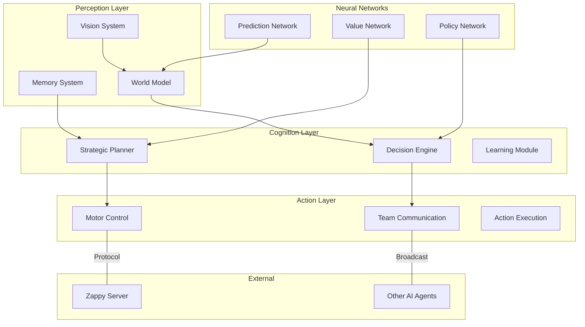

# Zappy AI Client

The Zappy AI client represents the culmination of artificial intelligence design for autonomous gameplay. Built in Python with advanced machine learning capabilities, it implements sophisticated strategies, neural networks, and memory systems to compete effectively in the Zappy universe.

## 🧠 Intelligence Overview

The AI client is designed as an autonomous agent capable of:

- **Strategic Decision Making** - Long-term planning and goal optimization
- **Real-time Adaptation** - Dynamic response to changing game conditions
- **Team Coordination** - Collaborative behavior with teammates
- **Learning & Evolution** - Continuous improvement through experience
- **Resource Management** - Efficient collection and utilization strategies

## 🏗️ Architecture

The AI follows a layered architecture inspired by cognitive science and modern AI practices:



## 🎯 Core Components

### 1. Vision System

The vision system processes the game world and maintains situational awareness:

```python
class VisionSystem:
    def __init__(self):
        self.vision_range = 3  # Player's vision distance
        self.vision_cache = {}
        self.last_look_time = 0
    
    def look(self) -> List[List[str]]:
        """Execute look command and parse vision data"""
        response = self.client.send_command("Look")
        vision_data = self.parse_vision(response)
        self.update_world_model(vision_data)
        return vision_data
    
    def parse_vision(self, raw_data: str) -> List[List[str]]:
        """Convert raw vision string to structured data"""
        # Parse "[ player food, linemate, ... ]" format
        items = raw_data.strip('[]').split(',')
        return self.organize_by_distance(items)
    
    def get_visible_resources(self) -> Dict[str, List[Tuple[int, int]]]:
        """Extract resource positions from vision"""
        resources = defaultdict(list)
        for distance, items in enumerate(self.current_vision):
            for item in items:
                if item in RESOURCES:
                    pos = self.calculate_absolute_position(distance, item)
                    resources[item].append(pos)
        return resources
```

### 2. Memory System

Advanced memory management for long-term strategic planning:

```python
class MemorySystem:
    def __init__(self):
        self.episodic_memory = []  # Specific experiences
        self.semantic_memory = {}  # General knowledge
        self.working_memory = {}   # Current context
        self.resource_map = {}     # Known resource locations
        self.danger_zones = set()  # Areas to avoid
        
    def remember_experience(self, state, action, reward, next_state):
        """Store experience for learning"""
        experience = Experience(state, action, reward, next_state, time.time())
        self.episodic_memory.append(experience)
        
        # Maintain memory size
        if len(self.episodic_memory) > MAX_MEMORY_SIZE:
            self.episodic_memory.pop(0)
    
    def update_resource_knowledge(self, position, resources):
        """Update known resource locations"""
        self.resource_map[position] = {
            'resources': resources,
            'last_seen': time.time(),
            'reliability': self.calculate_reliability(position)
        }
    
    def predict_resource_availability(self, position, resource_type):
        """Predict if resource is likely to be available"""
        if position not in self.resource_map:
            return 0.5  # Unknown, assume 50% chance
        
        data = self.resource_map[position]
        time_since_seen = time.time() - data['last_seen']
        base_probability = 1.0 if resource_type in data['resources'] else 0.0
        
        # Decay probability over time
        decay_factor = math.exp(-time_since_seen / RESOURCE_MEMORY_DECAY)
        return base_probability * decay_factor * data['reliability']
```

### 3. Strategic Planner

High-level strategic decision making:

```python
class StrategicPlanner:
    def __init__(self, ai_client):
        self.ai = ai_client
        self.current_strategy = None
        self.goal_stack = []
        self.strategies = {
            'survival': SurvivalStrategy(),
            'collection': ResourceCollectionStrategy(),
            'elevation': ElevationStrategy(),
            'reproduction': ReproductionStrategy(),
            'exploration': ExplorationStrategy()
        }
    
    def plan_next_action(self) -> str:
        """Determine the next action based on current situation"""
        # Evaluate current situation
        situation = self.analyze_situation()
        
        # Select appropriate strategy
        strategy = self.select_strategy(situation)
        
        # Generate action plan
        action_plan = strategy.generate_plan(self.ai, situation)
        
        # Execute first action in plan
        return action_plan[0] if action_plan else 'Forward'
    
    def analyze_situation(self) -> Dict:
        """Analyze current game state"""
        return {
            'level': self.ai.level,
            'food': self.ai.inventory.get('food', 0),
            'inventory': self.ai.inventory.copy(),
            'position': self.ai.position,
            'teammates_nearby': self.ai.count_nearby_teammates(),
            'resources_visible': self.ai.vision.get_visible_resources(),
            'time_since_last_food': self.ai.time_since_last_food(),
            'elevation_possible': self.ai.can_elevate(),
            'team_needs': self.ai.get_team_needs()
        }
    
    def select_strategy(self, situation: Dict) -> Strategy:
        """Select the most appropriate strategy"""
        # Priority-based strategy selection
        if situation['food'] < CRITICAL_FOOD_LEVEL:
            return self.strategies['survival']
        elif situation['elevation_possible']:
            return self.strategies['elevation']
        elif self.ai.should_reproduce():
            return self.strategies['reproduction']
        elif self.ai.needs_resources_for_next_level():
            return self.strategies['collection']
        else:
            return self.strategies['exploration']
```

### 4. Neural Networks

Deep learning models for advanced decision making:

```python
import torch
import torch.nn as nn
import torch.nn.functional as F

class PolicyNetwork(nn.Module):
    """Neural network for action selection"""
    
    def __init__(self, state_size=64, action_size=12, hidden_size=128):
        super(PolicyNetwork, self).__init__()
        self.fc1 = nn.Linear(state_size, hidden_size)
        self.fc2 = nn.Linear(hidden_size, hidden_size)
        self.fc3 = nn.Linear(hidden_size, action_size)
        self.dropout = nn.Dropout(0.2)
        
    def forward(self, state):
        x = F.relu(self.fc1(state))
        x = self.dropout(x)
        x = F.relu(self.fc2(x))
        x = self.dropout(x)
        action_probs = F.softmax(self.fc3(x), dim=-1)
        return action_probs

class ValueNetwork(nn.Module):
    """Neural network for state value estimation"""
    
    def __init__(self, state_size=64, hidden_size=128):
        super(ValueNetwork, self).__init__()
        self.fc1 = nn.Linear(state_size, hidden_size)
        self.fc2 = nn.Linear(hidden_size, hidden_size)
        self.fc3 = nn.Linear(hidden_size, 1)
        
    def forward(self, state):
        x = F.relu(self.fc1(state))
        x = F.relu(self.fc2(x))
        value = self.fc3(x)
        return value

class ZappyAINetwork:
    def __init__(self):
        self.policy_net = PolicyNetwork()
        self.value_net = ValueNetwork()
        self.optimizer_policy = torch.optim.Adam(self.policy_net.parameters(), lr=0.001)
        self.optimizer_value = torch.optim.Adam(self.value_net.parameters(), lr=0.001)
        
    def get_action(self, state):
        """Get action from policy network"""
        state_tensor = torch.FloatTensor(state).unsqueeze(0)
        action_probs = self.policy_net(state_tensor)
        action = torch.multinomial(action_probs, 1).item()
        return action, action_probs[0][action].item()
    
    def train(self, experiences):
        """Train networks on batch of experiences"""
        states, actions, rewards, next_states, dones = zip(*experiences)
        
        states = torch.FloatTensor(states)
        actions = torch.LongTensor(actions)
        rewards = torch.FloatTensor(rewards)
        next_states = torch.FloatTensor(next_states)
        dones = torch.BoolTensor(dones)
        
        # Train value network
        current_values = self.value_net(states).squeeze()
        next_values = self.value_net(next_states).squeeze()
        target_values = rewards + (0.99 * next_values * ~dones)
        
        value_loss = F.mse_loss(current_values, target_values.detach())
        self.optimizer_value.zero_grad()
        value_loss.backward()
        self.optimizer_value.step()
        
        # Train policy network
        advantages = (target_values - current_values).detach()
        action_probs = self.policy_net(states)
        selected_action_probs = action_probs.gather(1, actions.unsqueeze(1)).squeeze()
        
        policy_loss = -(torch.log(selected_action_probs) * advantages).mean()
        self.optimizer_policy.zero_grad()
        policy_loss.backward()
        self.optimizer_policy.step()
```

## 🎮 Game Strategies

### Survival Strategy

Focuses on maintaining food levels and avoiding death:

```python
class SurvivalStrategy(Strategy):
    def generate_plan(self, ai, situation):
        food_level = situation['food']
        
        if food_level <= 1:
            # Critical - find food immediately
            return self.emergency_food_search(ai, situation)
        elif food_level <= 5:
            # Low - prioritize food collection
            return self.food_collection_plan(ai, situation)
        else:
            # Safe - maintain food while doing other activities
            return self.maintenance_plan(ai, situation)
    
    def emergency_food_search(self, ai, situation):
        """Immediate food search when critically low"""
        visible_food = situation['resources_visible'].get('food', [])
        
        if visible_food:
            # Move to closest food
            closest_food = min(visible_food, key=lambda pos: ai.distance_to(pos))
            return ai.path_to(closest_food) + ['Take food']
        else:
            # No visible food - search randomly
            return ['Look', 'Forward', 'Right', 'Look']
```

### Elevation Strategy

Coordinates with teammates for level advancement:

```python
class ElevationStrategy(Strategy):
    def generate_plan(self, ai, situation):
        if not situation['elevation_possible']:
            return []
        
        # Check if we have required resources
        required = ai.get_elevation_requirements(ai.level + 1)
        missing_resources = ai.get_missing_resources(required)
        
        if missing_resources:
            return self.collect_missing_resources(ai, missing_resources)
        
        # Check if enough teammates are nearby
        required_players = required.get('players', 1)
        nearby_teammates = situation['teammates_nearby']
        
        if nearby_teammates + 1 >= required_players:
            return self.initiate_elevation(ai)
        else:
            return self.coordinate_with_teammates(ai, required_players)
    
    def initiate_elevation(self, ai):
        """Start the elevation ritual"""
        # Drop required resources
        plan = []
        required = ai.get_elevation_requirements(ai.level + 1)
        
        for resource, count in required.items():
            if resource != 'players':
                for _ in range(count):
                    plan.append(f'Set {resource}')
        
        # Broadcast to teammates
        plan.append('Broadcast "Starting elevation"')
        plan.append('Incantation')
        
        return plan
```

### Resource Collection Strategy

Optimizes resource gathering efficiency:

```python
class ResourceCollectionStrategy(Strategy):
    def generate_plan(self, ai, situation):
        needed_resources = ai.get_needed_resources()
        visible_resources = situation['resources_visible']
        
        # Prioritize resources by need and proximity
        targets = []
        for resource_type, positions in visible_resources.items():
            if resource_type in needed_resources:
                priority = needed_resources[resource_type]
                for pos in positions:
                    distance = ai.distance_to(pos)
                    score = priority / (distance + 1)  # Higher priority, closer = higher score
                    targets.append((score, resource_type, pos))
        
        if targets:
            # Go for highest scoring target
            targets.sort(reverse=True)
            _, resource_type, target_pos = targets[0]
            return ai.path_to(target_pos) + [f'Take {resource_type}']
        else:
            # No needed resources visible - explore
            return self.exploration_pattern(ai)
```

## 🧪 Machine Learning

### Training Process

The AI uses reinforcement learning to improve performance:

```python
class RLTrainer:
    def __init__(self, ai_network):
        self.network = ai_network
        self.experience_buffer = []
        self.episode_rewards = []
        
    def train_episode(self, ai_client):
        """Train for one complete game episode"""
        total_reward = 0
        episode_experiences = []
        
        state = ai_client.get_state_vector()
        
        while not ai_client.is_game_over():
            # Get action from network
            action_idx, action_prob = self.network.get_action(state)
            action = ai_client.index_to_action(action_idx)
            
            # Execute action
            ai_client.execute_action(action)
            
            # Observe result
            next_state = ai_client.get_state_vector()
            reward = ai_client.calculate_reward()
            done = ai_client.is_game_over()
            
            # Store experience
            experience = (state, action_idx, reward, next_state, done)
            episode_experiences.append(experience)
            
            total_reward += reward
            state = next_state
            
            # Train on batch if buffer is full
            if len(self.experience_buffer) >= BATCH_SIZE:
                self.network.train(self.experience_buffer[-BATCH_SIZE:])
        
        # Add episode experiences to buffer
        self.experience_buffer.extend(episode_experiences)
        self.episode_rewards.append(total_reward)
        
        return total_reward
```

### State Representation

Converting game state to neural network input:

```python
def get_state_vector(self) -> np.ndarray:
    """Convert current game state to feature vector"""
    features = []
    
    # Player status
    features.extend([
        self.level / 8.0,  # Normalized level
        self.inventory.get('food', 0) / 20.0,  # Normalized food
        self.position[0] / self.world_width,  # Normalized X
        self.position[1] / self.world_height,  # Normalized Y
        self.orientation / 4.0  # Normalized orientation
    ])
    
    # Inventory (normalized)
    for resource in RESOURCES:
        count = self.inventory.get(resource, 0)
        features.append(min(count / 10.0, 1.0))
    
    # Vision (local area resources)
    vision_features = self.encode_vision()
    features.extend(vision_features)
    
    # Team status
    features.extend([
        len(self.teammates) / 10.0,  # Normalized team size
        self.team_average_level() / 8.0,  # Normalized team level
        self.time_since_last_communication() / 100.0  # Normalized time
    ])
    
    return np.array(features, dtype=np.float32)
```

### Reward Function

Shaping AI behavior through reward design:

```python
def calculate_reward(self) -> float:
    """Calculate reward for current state/action"""
    reward = 0.0
    
    # Survival reward
    if self.inventory.get('food', 0) > 0:
        reward += 0.1
    else:
        reward -= 1.0  # Heavy penalty for no food
    
    # Level progression reward
    if self.level > self.previous_level:
        reward += 10.0 * self.level  # Exponential level rewards
    
    # Resource collection reward
    total_resources = sum(self.inventory.get(r, 0) for r in RESOURCES[1:])
    reward += total_resources * 0.1
    
    # Team coordination reward
    if self.recent_team_elevation:
        reward += 5.0
    
    # Exploration reward (new tiles discovered)
    if self.discovered_new_tile:
        reward += 0.2
    
    # Efficiency penalty (too many actions without progress)
    if self.actions_since_progress > 50:
        reward -= 0.1
    
    return reward
```

## 🤝 Team Coordination

### Communication Protocol

AI agents coordinate through broadcast messages:

```python
class TeamCommunication:
    def __init__(self, ai_client):
        self.ai = ai_client
        self.message_handlers = {
            'HELP': self.handle_help_request,
            'ELEVATION': self.handle_elevation_request,
            'RESOURCE': self.handle_resource_info,
            'DANGER': self.handle_danger_warning
        }
    
    def broadcast_message(self, message_type: str, data: Dict):
        """Send message to all teammates"""
        message = self.encode_message(message_type, data)
        self.ai.send_command(f'Broadcast {message}')
    
    def handle_incoming_message(self, sender_id: int, message: str):
        """Process received broadcast message"""
        try:
            msg_type, data = self.decode_message(message)
            if msg_type in self.message_handlers:
                self.message_handlers[msg_type](sender_id, data)
        except Exception as e:
            self.ai.log_error(f"Failed to process message: {e}")
    
    def coordinate_elevation(self):
        """Coordinate elevation ritual with teammates"""
        if not self.ai.can_elevate():
            return
        
        # Broadcast elevation intention
        self.broadcast_message('ELEVATION', {
            'level': self.ai.level,
            'position': self.ai.position,
            'required_players': self.ai.get_elevation_requirements()['players'],
            'timeout': time.time() + 30  # 30 second timeout
        })
        
        # Wait for responses
        self.ai.set_state('waiting_for_elevation_team')
```

### Shared Knowledge

Maintaining team-wide situational awareness:

```python
class SharedKnowledge:
    def __init__(self):
        self.resource_database = {}  # Shared resource locations
        self.danger_zones = set()    # Known dangerous areas
        self.teammate_status = {}    # Last known teammate states
        
    def update_resource_info(self, position: Tuple[int, int], resources: List[str]):
        """Update shared resource knowledge"""
        self.resource_database[position] = {
            'resources': resources,
            'last_updated': time.time(),
            'reporter_count': self.resource_database.get(position, {}).get('reporter_count', 0) + 1
        }
    
    def get_best_resource_locations(self, resource_type: str) -> List[Tuple[int, int]]:
        """Get most reliable resource locations"""
        candidates = []
        for pos, data in self.resource_database.items():
            if resource_type in data['resources']:
                reliability = data['reporter_count'] / (time.time() - data['last_updated'] + 1)
                candidates.append((reliability, pos))
        
        candidates.sort(reverse=True)
        return [pos for _, pos in candidates[:5]]  # Top 5 locations
```

## 📊 Performance Metrics

### AI Evaluation

Comprehensive metrics for AI performance assessment:

```python
class AIMetrics:
    def __init__(self):
        self.games_played = 0
        self.games_won = 0
        self.average_level_reached = 0.0
        self.total_survival_time = 0.0
        self.resource_collection_efficiency = 0.0
        self.team_coordination_score = 0.0
        
    def record_game_result(self, final_level: int, survival_time: float, 
                          resources_collected: int, team_elevations: int, won: bool):
        """Record results from completed game"""
        self.games_played += 1
        if won:
            self.games_won += 1
            
        # Update rolling averages
        alpha = 0.1  # Learning rate for averages
        self.average_level_reached = (1 - alpha) * self.average_level_reached + alpha * final_level
        self.total_survival_time += survival_time
        
        # Calculate efficiency metrics
        efficiency = resources_collected / max(survival_time, 1.0)
        self.resource_collection_efficiency = (1 - alpha) * self.resource_collection_efficiency + alpha * efficiency
        
        coordination = team_elevations / max(final_level, 1.0)
        self.team_coordination_score = (1 - alpha) * self.team_coordination_score + alpha * coordination
        
    def get_win_rate(self) -> float:
        return self.games_won / max(self.games_played, 1)
    
    def get_average_survival_time(self) -> float:
        return self.total_survival_time / max(self.games_played, 1)
    
    def generate_report(self) -> str:
        """Generate comprehensive performance report"""
        return f"""
AI Performance Report
====================
Games Played: {self.games_played}
Win Rate: {self.get_win_rate():.2%}
Average Level: {self.average_level_reached:.1f}
Average Survival: {self.get_average_survival_time():.1f}s
Collection Efficiency: {self.resource_collection_efficiency:.2f}
Team Coordination: {self.team_coordination_score:.2f}
        """
```

## 🛠️ Configuration & Tuning

### AI Parameters

Extensive configuration system for AI behavior tuning:

**config/ai_params.json**
```json
{
  "survival": {
    "critical_food_level": 2,
    "safe_food_level": 8,
    "food_search_radius": 5,
    "panic_mode_threshold": 1
  },
  "collection": {
    "resource_priorities": {
      "food": 10,
      "linemate": 8,
      "deraumere": 6,
      "sibur": 6,
      "mendiane": 4,
      "phiras": 4,
      "thystame": 2
    },
    "collection_efficiency_weight": 0.7,
    "exploration_weight": 0.3
  },
  "elevation": {
    "coordination_timeout": 30,
    "min_teammates_for_ritual": 1,
    "preparation_time": 10,
    "resource_safety_margin": 1
  },
  "neural_network": {
    "learning_rate": 0.001,
    "batch_size": 32,
    "memory_size": 10000,
    "epsilon_start": 1.0,
    "epsilon_end": 0.01,
    "epsilon_decay": 0.995
  }
}
```

## 🧪 Testing & Validation

### AI Testing Suite

Comprehensive testing framework for AI validation:

```bash
# Run basic AI functionality tests
python -m pytest tests/test_ai_basic.py

# Run strategy tests
python -m pytest tests/test_strategies.py

# Run neural network tests
python -m pytest tests/test_neural_networks.py

# Run integration tests
python -m pytest tests/test_ai_integration.py

# Generate AI performance report
python scripts/ai_performance_analysis.py
```

### Simulation Environment

Test AI in controlled environments:

```python
class AISimulator:
    def __init__(self):
        self.mock_server = MockZappyServer()
        self.test_scenarios = [
            'resource_scarcity',
            'team_coordination',
            'elevation_challenge',
            'survival_pressure'
        ]
    
    def run_scenario_test(self, scenario: str, ai_config: Dict) -> Dict:
        """Test AI performance in specific scenario"""
        self.mock_server.load_scenario(scenario)
        ai_client = ZappyAI(config=ai_config)
        ai_client.connect_to_simulator(self.mock_server)
        
        results = []
        for _ in range(100):  # 100 test runs
            result = self.mock_server.run_simulation(ai_client)
            results.append(result)
        
        return self.analyze_results(results)
```

## 🔗 Advanced Topics

### Genetic Algorithm Optimization

Evolve AI parameters for optimal performance:

```python
class GeneticOptimizer:
    def __init__(self, population_size=50):
        self.population_size = population_size
        self.population = self.create_initial_population()
        
    def evolve_generation(self):
        """Evolve AI parameters for one generation"""
        # Evaluate fitness
        fitness_scores = []
        for individual in self.population:
            score = self.evaluate_fitness(individual)
            fitness_scores.append(score)
        
        # Selection
        parents = self.tournament_selection(self.population, fitness_scores)
        
        # Crossover and mutation
        offspring = []
        for i in range(0, len(parents), 2):
            child1, child2 = self.crossover(parents[i], parents[i+1])
            offspring.extend([self.mutate(child1), self.mutate(child2)])
        
        self.population = offspring
```

### Multi-Agent Reinforcement Learning

Advanced team learning approaches:

```python
class MADDPGTrainer:
    """Multi-Agent Deep Deterministic Policy Gradient"""
    
    def __init__(self, num_agents=3):
        self.num_agents = num_agents
        self.agents = [DDPGAgent(state_size=64, action_size=12) for _ in range(num_agents)]
        self.shared_memory = ReplayBuffer(capacity=100000)
        
    def train_step(self, experiences):
        """Train all agents simultaneously"""
        for agent_id, agent in enumerate(self.agents):
            agent_experiences = experiences[agent_id]
            other_agents_actions = [exp.action for i, exp in enumerate(experiences) if i != agent_id]
            agent.train(agent_experiences, other_agents_actions)
```

## 🔗 Related Documentation

- **[Neural Networks Deep Dive](neural-networks.md)** - Detailed NN architecture
- **[Memory System](memory-system.md)** - Advanced memory management
- **[Strategy Guide](strategies.md)** - Complete strategy documentation
- **[Testing Framework](testing.md)** - AI testing and validation
- **[Performance Tuning](performance.md)** - Optimization techniques

---

The Zappy AI represents the state-of-the-art in autonomous game agents, combining classical AI techniques with modern machine learning to create intelligent, adaptive, and cooperative players capable of competing at the highest levels of Zappy gameplay.
