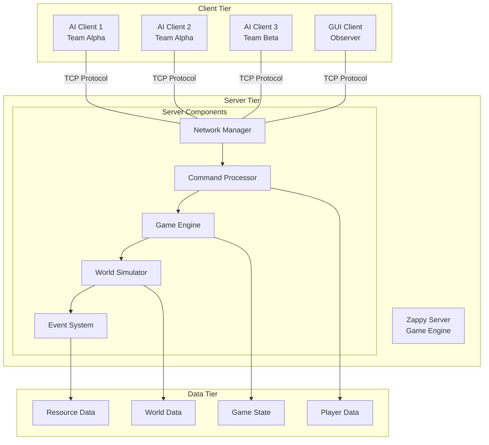
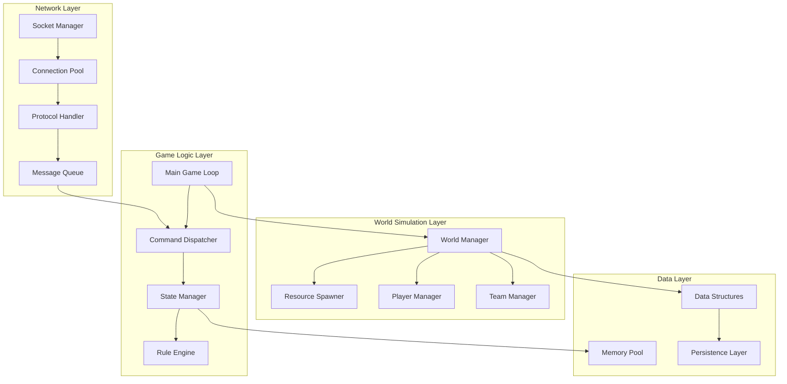
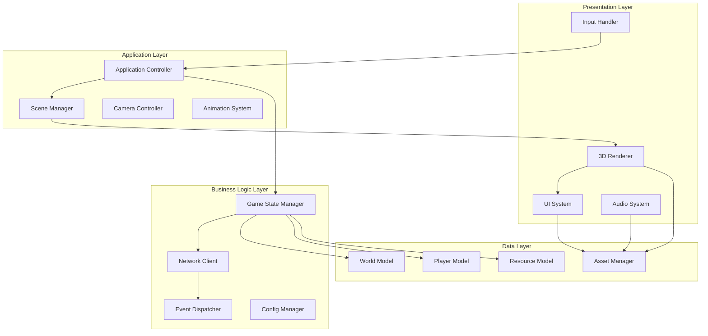
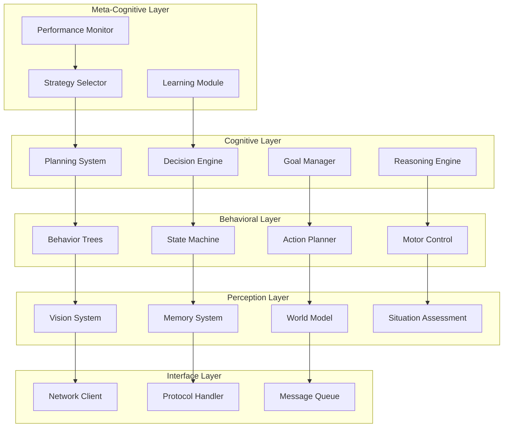
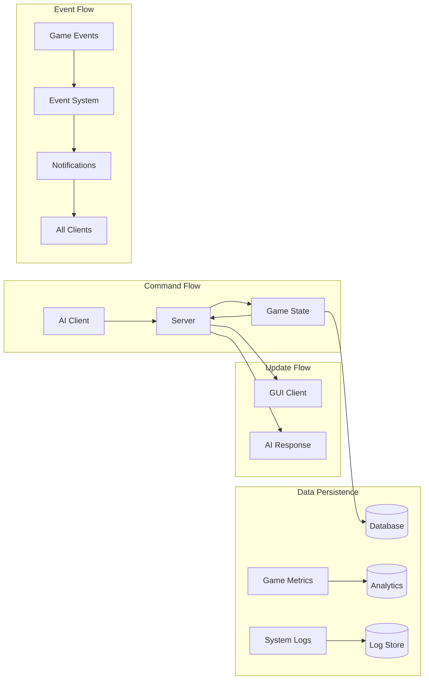
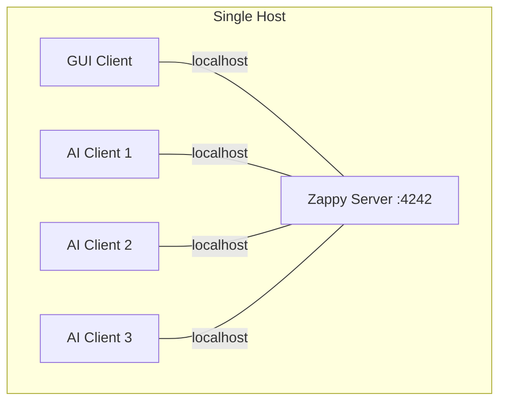
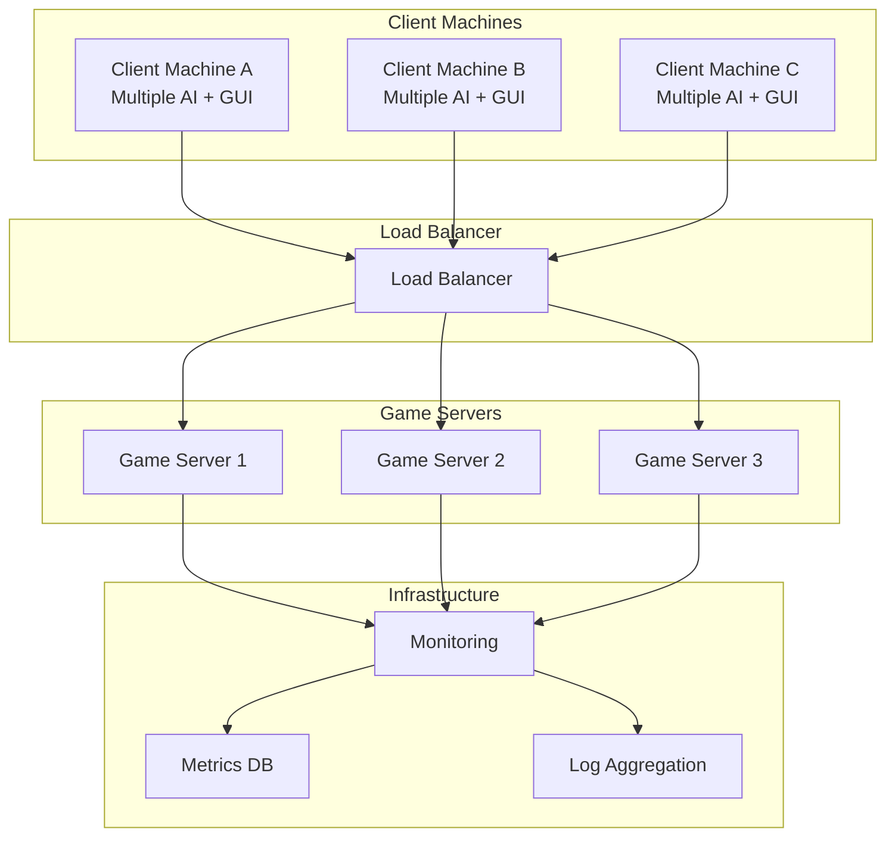

# Zappy Architecture

This document provides a comprehensive overview of the Zappy system architecture, covering the design principles, component interactions, data flow, and technical implementation details that make Zappy a robust and scalable multiplayer gaming platform.

## 🏗️ System Overview

Zappy follows a distributed client-server architecture with three primary components working in concert to deliver a seamless multiplayer gaming experience.



## 🎯 Design Principles

### Core Principles

1. **Modularity**: Each component has well-defined responsibilities and interfaces
2. **Scalability**: Architecture supports multiple concurrent games and clients
3. **Reliability**: Robust error handling and graceful degradation
4. **Performance**: Optimized for real-time gaming with minimal latency
5. **Extensibility**: Easy to add new features and game modes
6. **Maintainability**: Clean code structure and comprehensive documentation

### Architectural Patterns

- **Client-Server**: Centralized game logic with distributed clients
- **Event-Driven**: Asynchronous event processing for real-time updates
- **Component-Based**: Modular components with clear interfaces
- **Observer Pattern**: GUI clients observe game state changes
- **Command Pattern**: Encapsulated player actions as command objects
- **State Machine**: Player and game state management

## 🖥️ Server Architecture

### High-Level Structure

The Zappy server is built in C with a focus on performance and reliability:



### Core Components

#### Network Manager

Handles all client connections using non-blocking I/O:

```c
typedef struct network_manager_s {
    int                 server_socket;
    struct sockaddr_in  server_addr;
    fd_set             read_fds;
    fd_set             write_fds;
    client_list_t      *clients;
    int                max_clients;
    int                current_clients;
} network_manager_t;

// Non-blocking client handling
int handle_network_events(network_manager_t *net_mgr) {
    fd_set read_copy = net_mgr->read_fds;
    fd_set write_copy = net_mgr->write_fds;
    
    struct timeval timeout = {0, 0};  // Non-blocking
    int activity = select(FD_SETSIZE, &read_copy, &write_copy, NULL, &timeout);
    
    if (activity > 0) {
        handle_new_connections(net_mgr, &read_copy);
        handle_client_data(net_mgr, &read_copy);
        handle_client_writes(net_mgr, &write_copy);
    }
    
    return activity;
}
```

#### Game Engine

Central orchestrator managing game state and rules:

```c
typedef struct game_engine_s {
    world_t            *world;
    team_manager_t     *team_mgr;
    player_manager_t   *player_mgr;
    event_scheduler_t  *scheduler;
    game_rules_t       *rules;
    game_state_t       state;
    double             frequency;
    clock_t            last_tick;
} game_engine_t;

// Main game loop
void game_engine_tick(game_engine_t *engine) {
    clock_t current_time = clock();
    double delta_time = (double)(current_time - engine->last_tick) / CLOCKS_PER_SEC;
    
    // Process scheduled events
    event_scheduler_process(engine->scheduler, delta_time);
    
    // Update world simulation
    world_update(engine->world, delta_time);
    
    // Process player actions
    player_manager_update(engine->player_mgr, delta_time);
    
    // Check victory conditions
    check_victory_conditions(engine);
    
    engine->last_tick = current_time;
}
```

#### World Simulator

Manages the game world, resources, and spatial relationships:

```c
typedef struct world_s {
    tile_t     **tiles;
    int        width;
    int        height;
    double     frequency;
    resource_spawner_t *spawner;
    spatial_index_t    *spatial_index;
} world_t;

typedef struct tile_s {
    int        x;
    int        y;
    resources_t resources;
    player_list_t *players;
    egg_list_t    *eggs;
    bool       dirty;  // Needs GUI update
} tile_t;

// Toroidal coordinate system
coordinate_t world_normalize_position(world_t *world, int x, int y) {
    coordinate_t pos;
    pos.x = ((x % world->width) + world->width) % world->width;
    pos.y = ((y % world->height) + world->height) % world->height;
    return pos;
}
```

### Performance Optimizations

#### Memory Management

- **Object Pooling**: Reuse common objects (commands, messages, events)
- **Memory Arenas**: Pre-allocated memory blocks for predictable allocation
- **Cache-Friendly Data**: Structures optimized for CPU cache performance

```c
typedef struct memory_pool_s {
    void       *pool;
    size_t     block_size;
    size_t     pool_size;
    uint8_t    *allocation_bitmap;
    int        next_free_block;
} memory_pool_t;

// Fast object allocation from pool
void* memory_pool_alloc(memory_pool_t *pool) {
    if (pool->next_free_block >= pool->pool_size) {
        return NULL;  // Pool exhausted
    }
    
    void *ptr = (char*)pool->pool + (pool->next_free_block * pool->block_size);
    mark_block_allocated(pool, pool->next_free_block);
    find_next_free_block(pool);
    
    return ptr;
}
```

#### Network Optimization

- **Message Batching**: Combine multiple updates into single packets
- **Delta Compression**: Send only changed data to GUI clients
- **Priority Queuing**: Prioritize critical game events over routine updates

## 🎨 GUI Client Architecture

### Component Architecture

The GUI client uses a modern C++ architecture with clear separation of concerns:



### Key Design Patterns

#### Model-View-Controller (MVC)

```cpp
// Model: Game data representation
class WorldModel {
private:
    std::vector<std::vector<Tile>> tiles_;
    std::vector<Player> players_;
    std::unordered_map<int, Team> teams_;
    
public:
    void UpdateTile(int x, int y, const TileData& data);
    void UpdatePlayer(int id, const PlayerData& data);
    const Tile& GetTile(int x, int y) const;
    const Player& GetPlayer(int id) const;
    
    // Observer pattern for notifications
    void RegisterObserver(IWorldObserver* observer);
    void NotifyObservers(const WorldEvent& event);
};

// View: Rendering and presentation
class WorldRenderer {
private:
    std::unique_ptr<Camera> camera_;
    std::unique_ptr<Shader> tile_shader_;
    std::unique_ptr<Shader> player_shader_;
    
public:
    void Render(const WorldModel& model);
    void RenderTiles(const std::vector<std::vector<Tile>>& tiles);
    void RenderPlayers(const std::vector<Player>& players);
    void SetCamera(const Camera& camera);
};

// Controller: User input and coordination
class ApplicationController {
private:
    std::unique_ptr<WorldModel> model_;
    std::unique_ptr<WorldRenderer> renderer_;
    std::unique_ptr<NetworkClient> network_;
    
public:
    void HandleInput(const InputEvent& event);
    void Update(float deltaTime);
    void ProcessNetworkMessage(const ProtocolMessage& message);
};
```

#### Component System

```cpp
// Entity-Component system for game objects
class Entity {
private:
    static int next_id_;
    int id_;
    std::unordered_map<std::type_index, std::unique_ptr<Component>> components_;
    
public:
    template<typename T, typename... Args>
    T* AddComponent(Args&&... args) {
        auto component = std::make_unique<T>(std::forward<Args>(args)...);
        T* ptr = component.get();
        components_[std::type_index(typeid(T))] = std::move(component);
        return ptr;
    }
    
    template<typename T>
    T* GetComponent() {
        auto it = components_.find(std::type_index(typeid(T)));
        return it != components_.end() ? static_cast<T*>(it->second.get()) : nullptr;
    }
};

// Example components
class TransformComponent : public Component {
public:
    Vector3 position;
    Vector3 rotation;
    Vector3 scale;
};

class RenderComponent : public Component {
public:
    std::shared_ptr<Mesh> mesh;
    std::shared_ptr<Material> material;
    bool visible = true;
};
```

### Rendering Pipeline

Modern graphics pipeline with support for 3D rendering:

```cpp
class RenderPipeline {
private:
    std::vector<std::unique_ptr<RenderPass>> passes_;
    std::unique_ptr<FrameBuffer> gbuffer_;
    std::unique_ptr<FrameBuffer> final_buffer_;
    
public:
    void Initialize() {
        // Create render passes
        passes_.push_back(std::make_unique<ShadowPass>());
        passes_.push_back(std::make_unique<GeometryPass>());
        passes_.push_back(std::make_unique<LightingPass>());
        passes_.push_back(std::make_unique<PostProcessPass>());
        
        // Create framebuffers
        gbuffer_ = CreateGBuffer(screen_width_, screen_height_);
        final_buffer_ = CreateFrameBuffer(screen_width_, screen_height_);
    }
    
    void Render(const Scene& scene, const Camera& camera) {
        // Execute render passes in sequence
        for (auto& pass : passes_) {
            pass->Execute(scene, camera, *gbuffer_, *final_buffer_);
        }
        
        // Present final result
        Present(*final_buffer_);
    }
};
```

## 🤖 AI Client Architecture

### Layered Intelligence Architecture

The AI client implements a sophisticated multi-layer intelligence system:



### Neural Network Architecture

Advanced deep learning models for decision making:

```python
class ZappyNeuralArchitecture(nn.Module):
    def __init__(self, state_size=128, action_size=12):
        super().__init__()
        
        # Convolutional layers for spatial reasoning
        self.conv_layers = nn.Sequential(
            nn.Conv2d(7, 32, kernel_size=3, padding=1),  # 7 resource types
            nn.ReLU(),
            nn.Conv2d(32, 64, kernel_size=3, padding=1),
            nn.ReLU(),
            nn.AdaptiveAvgPool2d((4, 4))  # Reduce to 4x4
        )
        
        # Recurrent layers for temporal reasoning
        self.lstm = nn.LSTM(
            input_size=64 * 4 * 4 + 32,  # Conv output + status features
            hidden_size=256,
            num_layers=2,
            batch_first=True,
            dropout=0.2
        )
        
        # Attention mechanism
        self.attention = nn.MultiheadAttention(
            embed_dim=256,
            num_heads=8,
            dropout=0.1
        )
        
        # Policy and value heads
        self.policy_head = nn.Sequential(
            nn.Linear(256, 128),
            nn.ReLU(),
            nn.Dropout(0.2),
            nn.Linear(128, action_size),
            nn.Softmax(dim=-1)
        )
        
        self.value_head = nn.Sequential(
            nn.Linear(256, 128),
            nn.ReLU(),
            nn.Dropout(0.2),
            nn.Linear(128, 1),
            nn.Tanh()
        )
    
    def forward(self, spatial_input, status_input, hidden_state=None):
        # Process spatial information
        spatial_features = self.conv_layers(spatial_input)
        spatial_features = spatial_features.view(spatial_features.size(0), -1)
        
        # Combine spatial and status features
        combined_input = torch.cat([spatial_features, status_input], dim=-1)
        combined_input = combined_input.unsqueeze(1)  # Add sequence dimension
        
        # Process through LSTM
        lstm_output, new_hidden = self.lstm(combined_input, hidden_state)
        
        # Apply attention
        attended_output, attention_weights = self.attention(
            lstm_output, lstm_output, lstm_output
        )
        
        # Generate policy and value
        features = attended_output.squeeze(1)
        policy = self.policy_head(features)
        value = self.value_head(features)
        
        return policy, value, new_hidden, attention_weights
```

## 📊 Data Flow Architecture

### Information Flow

The system maintains several data flows for different purposes:



### State Synchronization

Maintaining consistency across distributed components:

```c
// State synchronization mechanism
typedef struct sync_manager_s {
    uint64_t           version;
    dirty_flags_t      dirty_tiles;
    dirty_flags_t      dirty_players;
    client_list_t      *gui_clients;
    sync_buffer_t      *pending_updates;
} sync_manager_t;

void sync_manager_mark_dirty(sync_manager_t *sync, entity_type_t type, int id) {
    switch (type) {
        case ENTITY_TILE:
            set_bit(sync->dirty_tiles.flags, id);
            break;
        case ENTITY_PLAYER:
            set_bit(sync->dirty_players.flags, id);
            break;
    }
    sync->version++;
}

void sync_manager_flush_updates(sync_manager_t *sync) {
    for (client_t *client = sync->gui_clients; client; client = client->next) {
        send_delta_updates(client, sync->dirty_tiles, sync->dirty_players);
    }
    
    clear_dirty_flags(sync);
}
```

## 🔧 Deployment Architecture

### Single-Server Deployment

For development and small-scale deployments:



### Distributed Deployment

For production and tournament environments:



## 🔐 Security Architecture

### Network Security

- **Input Validation**: All client commands are validated before processing
- **Rate Limiting**: Protection against command flooding and abuse
- **Connection Limits**: Maximum connections per IP and per team
- **Protocol Validation**: Strict adherence to protocol specification

```c
// Input validation and sanitization
typedef struct validator_s {
    command_limits_t   *limits;
    rate_limiter_t     *rate_limiter;
    input_sanitizer_t  *sanitizer;
} validator_t;

bool validate_command(validator_t *validator, client_t *client, char *command) {
    // Rate limiting check
    if (!rate_limiter_check(validator->rate_limiter, client->id)) {
        return false;
    }
    
    // Input sanitization
    if (!sanitize_input(validator->sanitizer, command)) {
        return false;
    }
    
    // Command-specific validation
    return validate_command_syntax(command) && 
           validate_command_permissions(client, command);
}
```

### Data Protection

- **Memory Safety**: Bounds checking and safe string operations
- **Resource Limits**: Prevention of resource exhaustion attacks
- **State Validation**: Consistency checks for game state integrity

## 📈 Performance Characteristics

### Scalability Metrics

| Component | Concurrent Clients | Memory Usage | CPU Usage | Network Bandwidth |
|-----------|-------------------|--------------|-----------|-------------------|
| **Server** | 100+ | 50MB base + 1MB/client | <5% | 1MB/s per game |
| **GUI Client** | 1 observer | 200MB | 10-20% | 100KB/s |
| **AI Client** | 1 player | 100MB | 5-15% | 10KB/s |

### Optimization Strategies

1. **Server Optimizations**:
   - Non-blocking I/O for network operations
   - Memory pools for frequent allocations
   - Spatial indexing for collision detection
   - Delta compression for GUI updates

2. **Client Optimizations**:
   - Level-of-detail rendering for distant objects
   - Frustum culling for off-screen entities
   - Texture atlasing for batch rendering
   - Asynchronous networking

3. **AI Optimizations**:
   - Neural network quantization
   - Behavior caching and memoization
   - Hierarchical pathfinding
   - Predictive state caching

## 🔗 Integration Points

### External System Integration

The architecture supports integration with external systems:

- **Tournament Platforms**: API for automated tournament management
- **Analytics Systems**: Metrics export for performance analysis  
- **Monitoring Tools**: Health checks and performance monitoring
- **Database Systems**: Game state persistence and replay storage

### API Design

```python
# Example external API interface
class ZappyGameAPI:
    def create_game(self, config: GameConfig) -> GameSession:
        """Create new game instance"""
        
    def get_game_state(self, game_id: str) -> GameState:
        """Get current game state"""
        
    def get_game_metrics(self, game_id: str) -> GameMetrics:
        """Get performance metrics"""
        
    def register_observer(self, game_id: str, callback: Callable):
        """Register for real-time updates"""
```

## 🔗 Related Documentation

- **[Server Implementation](server/README.md)** - Detailed server architecture
- **[GUI Client Design](gui/README.md)** - GUI architecture and rendering
- **[AI Architecture](ai/README.md)** - AI system design and implementation
- **[Network Protocol](protocol.md)** - Communication protocol specification
- **[Performance Guide](performance.md)** - Optimization and tuning
- **[Deployment Guide](deployment/README.md)** - Production deployment strategies

---

The Zappy architecture provides a robust, scalable, and maintainable foundation for competitive multiplayer gaming. Its modular design and clear separation of concerns enable rapid development while maintaining high performance and reliability standards.
