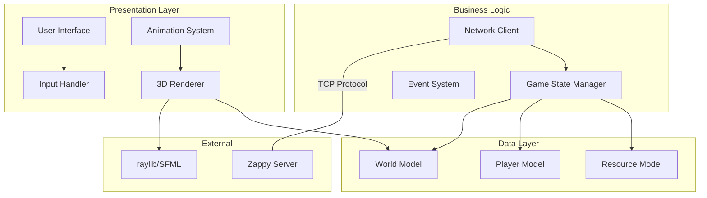

# Zappy GUI Client

The Zappy GUI is a beautiful 3D visualization client that provides real-time rendering of the game world. Built with modern C++17 and powered by raylib, it offers an immersive and intuitive way to observe Zappy matches as they unfold.


## 🎨 Features

### Visual Excellence
- **3D Rendering**: Beautiful 3D visualization of the toroidal game world
- **Real-time Updates**: Smooth animations and instant state synchronization  
- **Team Colors**: Distinct visual representation for each team
- **Resource Visualization**: Clear icons and models for all game resources
- **Particle Effects**: Stunning visual effects for special events

### Interactive Interface
- **Free Camera**: Full 3D camera control with mouse and keyboard
- **Information Panels**: Detailed statistics and game information overlays
- **Debug Console**: Raw protocol message viewing for development
- **Zoom & Pan**: Intuitive navigation controls for any map size

### Advanced Graphics
- **Smooth Animations**: Interpolated player movements and actions
- **Texture Mapping**: High-quality textures for immersive experience
- **Post-processing**: Modern graphics effects and filters

## 🏗️ Architecture

The GUI follows a clean MVC (Model-View-Controller) architecture:



## 🚀 Getting Started

### Prerequisites

Ensure you have the required dependencies:

<!-- tabs:start -->

#### **Ubuntu/Debian**
```bash
sudo apt update
sudo apt install -y build-essential cmake pkg-config libsfml-dev libglfw3-dev libgl1-mesa-dev
```

#### **CentOS/RHEL**
```bash
sudo yum groupinstall "Development Tools"
sudo yum install cmake sfml-devel glfw-devel mesa-libGL-devel
```

#### **macOS**
```bash
brew install cmake sfml glfw
```

#### **Windows**
```powershell
# Using vcpkg
vcpkg install sfml glfw3
```

<!-- tabs:end -->

### Building

```bash
# From the project root
mkdir build && cd build
cmake ..
make zappy_gui
```

### Running

```bash
# Connect to a running server
./zappy_gui -p 4242 -h localhost

# With custom settings
./zappy_gui -p 4242 -h server.example.com --fullscreen --vsync
```

### Command Line Options

| Option | Description | Default | Example |
|--------|-------------|---------|---------|
| `-p` | Server port | Required | `-p 4242` |
| `-h` | Server hostname | `localhost` | ` ` |

## 🎮 Controls

### Camera Controls

| Action | Input | Description |
|--------|-------|-------------|
| **Rotate View** | Q / D | Free-look camera rotation |
| **Zoom In/Out** | Z / S | Adjust camera distance |
| **Reset View** | `R` | Return to default camera position |
| **Top View** | `T` | Switch to top-down orthographic view |

### Interface Controls

| Action | Input | Description |
|--------|-------|-------------|
| **Toggle UI** | `F1` | Show/hide all UI elements |
| **Toggle Debug** | `F2` | Show/hide debug information |
| **Menu** | `M` | Activate menu |

### Selection

| Action | Input | Description |
|--------|-------|-------------|
| **Select Player** | Left Click | Select player for detailed view |
| **Select Tile** | Left Click | Show tile information |

## 🎨 Visual Elements

### World Representation

#### Map Tiles
- **Grid Lines**: Subtle grid overlay showing tile boundaries
- **Resource Indicators**: Icons showing available resources on each tile

#### Players
- **Team Colors**: Each team has a distinct color scheme
- **Level Indicators**: Visual progression showing player levels
- **Direction Arrows**: Clear indication of player orientation
- **Status Effects**: Visual feedback for special states (incantation, etc.)

#### Resources
- **3D Models**: Distinct color sphere for each resource type
- **Quantity Indicators**: Number overlays for resource stacks

### UI Components

#### Information Panels

**Team Statistics Panel**
```
┌─ Team Alpha (Red) ────────────┐
│ Players: 3/5                  │
│ Level 1: 2 players            │
│ Level 2: 1 player             │
│ Level 3: 0 players            │
│ Resources: 45 total           │
│ Status: Active                │
└───────────────────────────────┘
```

**Player Details Panel**
```
┌──────── Player #42 ──────────┐
│ Level: 2                     │
│ Team: TeamA                  │
│ Position: 5, 7               │
│ Orientation: North           │
│ Inventory:                   │
│   Food: 3                    │
│   Linemate: 1                │
│   Deraumere: 0               │
└──────────────────────────────┘
```

**Game Status Panel**
```
┌─ Game Status ─────────────────┐
│ Time: 05:23.4                 │
│ Frequency: 100 Hz             │
│ Map: 10x10 (Toroidal)         │
│ Teams: 3 active               │
│ Players: 8 total              │
│ Victory: First to 6 @ Lv8     │
└───────────────────────────────┘
```

#### Debug Console

The debug console shows raw protocol messages:

```
Received: [WELCOME]
Received: [bct 0 0 0 1 1 0 0 0 0]
```

## 🔗 Reference

### Main Classes

- **`Renderer`** - 3D rendering engine
- **`CLient`** - Server communication
- **`Camera`** - Camera control system

## 🔗 Related Documentation

- **[Network Protocol](../protocol.md)** - Communication with server
- **[Server Documentation](../server/README.md)** - Server implementation details
- **[Controls Reference](controls.md)** - Complete controls guide
- **[Configuration Guide](configuration.md)** - Advanced configuration options

---

The Zappy GUI provides an immersive and powerful way to visualize and understand the game dynamics. Its modern architecture and extensive customization options make it suitable for both casual observation and competitive analysis.
