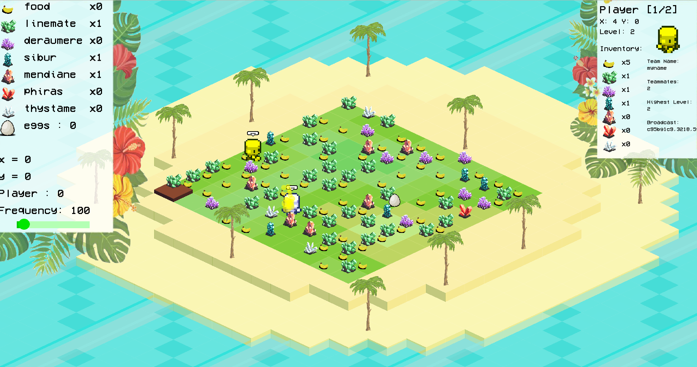
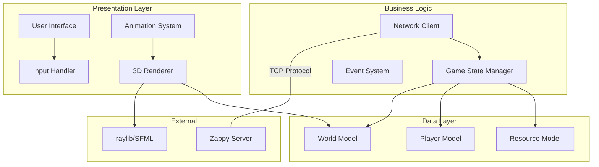

# Zappy GUI Client

The Zappy GUI is a beautiful 3D visualization client that provides real-time rendering of the game world. Built with modern C++17 and powered by raylib/SFML, it offers an immersive and intuitive way to observe Zappy matches as they unfold.



## 🎨 Features

### Visual Excellence
- **3D Rendering**: Beautiful 3D visualization of the toroidal game world
- **Real-time Updates**: Smooth animations and instant state synchronization  
- **Team Colors**: Distinct visual representation for each team
- **Resource Visualization**: Clear icons and models for all game resources
- **Particle Effects**: Stunning visual effects for special events

### Interactive Interface
- **Free Camera**: Full 3D camera control with mouse and keyboard
- **Information Panels**: Detailed statistics and game information overlays
- **Debug Console**: Raw protocol message viewing for development
- **Zoom & Pan**: Intuitive navigation controls for any map size

### Advanced Graphics
- **Smooth Animations**: Interpolated player movements and actions
- **Lighting Effects**: Dynamic lighting for better depth perception
- **Texture Mapping**: High-quality textures for immersive experience
- **Post-processing**: Modern graphics effects and filters

## 🏗️ Architecture

The GUI follows a clean MVC (Model-View-Controller) architecture:



## 🚀 Getting Started

### Prerequisites

Ensure you have the required dependencies:

<!-- tabs:start -->

#### **Ubuntu/Debian**
```bash
sudo apt update
sudo apt install -y build-essential cmake pkg-config libsfml-dev libglfw3-dev libgl1-mesa-dev
```

#### **CentOS/RHEL**
```bash
sudo yum groupinstall "Development Tools"
sudo yum install cmake sfml-devel glfw-devel mesa-libGL-devel
```

#### **macOS**
```bash
brew install cmake sfml glfw
```

#### **Windows**
```powershell
# Using vcpkg
vcpkg install sfml glfw3
```

<!-- tabs:end -->

### Building

```bash
# From the project root
mkdir build && cd build
cmake ..
make zappy_gui
```

### Running

```bash
# Connect to a running server
./zappy_gui -p 4242 -h localhost

# With custom settings
./zappy_gui -p 4242 -h server.example.com --fullscreen --vsync
```

### Command Line Options

| Option | Description | Default | Example |
|--------|-------------|---------|---------|
| `-p, --port` | Server port | Required | `-p 4242` |
| `-h, --host` | Server hostname | `localhost` | `-h game.server.com` |
| `--fullscreen` | Start in fullscreen mode | `false` | `--fullscreen` |
| `--vsync` | Enable vertical sync | `true` | `--no-vsync` |
| `--width` | Window width | `1920` | `--width 1280` |
| `--height` | Window height | `1080` | `--height 720` |
| `--fps` | Target FPS | `60` | `--fps 120` |

## 🎮 Controls

### Camera Controls

| Action | Input | Description |
|--------|-------|-------------|
| **Rotate View** | Mouse Move | Free-look camera rotation |
| **Zoom In/Out** | Mouse Wheel | Adjust camera distance |
| **Pan Camera** | Middle Mouse + Drag | Move camera laterally |
| **Reset View** | `R` | Return to default camera position |
| **Top View** | `T` | Switch to top-down orthographic view |
| **3D View** | `3` | Switch to 3D perspective view |

### Navigation

| Action | Input | Description |
|--------|-------|-------------|
| **Move Forward** | `W` or `↑` | Move camera forward |
| **Move Backward** | `S` or `↓` | Move camera backward |
| **Move Left** | `A` or `←` | Strafe camera left |
| **Move Right** | `D` or `→` | Strafe camera right |
| **Move Up** | `Q` | Move camera up |
| **Move Down** | `E` | Move camera down |
| **Focus Player** | `F` | Center camera on selected player |

### Interface Controls

| Action | Input | Description |
|--------|-------|-------------|
| **Toggle UI** | `Tab` | Show/hide all UI elements |
| **Toggle Debug** | `F1` | Show/hide debug information |
| **Toggle Console** | `F2` | Show/hide protocol console |
| **Toggle Stats** | `F3` | Show/hide game statistics |
| **Screenshot** | `F12` | Save screenshot to file |
| **Fullscreen** | `F11` | Toggle fullscreen mode |
| **Pause** | `Space` | Pause/resume visual updates |

### Selection

| Action | Input | Description |
|--------|-------|-------------|
| **Select Player** | Left Click | Select player for detailed view |
| **Select Tile** | Right Click | Show tile information |
| **Multi-select** | Ctrl + Click | Select multiple entities |
| **Deselect All** | `Esc` | Clear all selections |

## 🎨 Visual Elements

### World Representation

#### Map Tiles
- **Grid Lines**: Subtle grid overlay showing tile boundaries
- **Height Variation**: Visual depth to distinguish tiles
- **Resource Indicators**: Icons showing available resources on each tile
- **Toroidal Edges**: Visual hints showing map wraparound points

#### Players
- **Team Colors**: Each team has a distinct color scheme
- **Level Indicators**: Visual progression showing player levels
- **Direction Arrows**: Clear indication of player orientation
- **Status Effects**: Visual feedback for special states (incantation, etc.)

#### Resources
- **3D Models**: Distinct 3D models for each resource type
- **Glow Effects**: Subtle glow to make resources easily visible
- **Collection Animation**: Smooth pickup animations
- **Quantity Indicators**: Number overlays for resource stacks

### UI Components

#### Information Panels

**Team Statistics Panel**
```
┌─ Team Alpha (Red) ────────────┐
│ Players: 3/5                  │
│ Level 1: 2 players           │
│ Level 2: 1 player            │
│ Level 3: 0 players           │
│ Resources: 45 total          │
│ Status: Active               │
└───────────────────────────────┘
```

**Player Details Panel**
```
┌─ Player #42 (Team Alpha) ─────┐
│ Position: (5, 7)             │
│ Level: 2                     │
│ Orientation: North           │
│ Inventory:                   │
│   Food: 3                    │
│   Linemate: 1                │
│   Deraumere: 0               │
│ Action: Moving Forward       │
│ Time Remaining: 5.2s         │
└───────────────────────────────┘
```

**Game Status Panel**
```
┌─ Game Status ─────────────────┐
│ Time: 05:23.4                │
│ Frequency: 100 Hz            │
│ Map: 10x10 (Toroidal)        │
│ Teams: 3 active              │
│ Players: 8 total             │
│ Victory: First to 6 @ Lv8    │
└───────────────────────────────┘
```

#### Debug Console

The debug console shows raw protocol messages:

```
[15:42:23.123] → GRAPHIC
[15:42:23.124] ← WELCOME
[15:42:23.125] ← 10 10
[15:42:23.200] ← msz 10 10
[15:42:23.201] ← bct 0 0 1 2 0 0 0 0 1
[15:42:23.202] ← bct 0 1 0 1 1 0 0 0 0
...
[15:42:24.100] ← ppo 1 5 7 2
[15:42:24.150] ← pin 1 5 7 food linemate
```

## 🔧 Configuration

### Graphics Settings

The GUI supports extensive customization through configuration files:

**config/graphics.json**
```json
{
  "window": {
    "width": 1920,
    "height": 1080,
    "fullscreen": false,
    "vsync": true,
    "msaa": 4
  },
  "rendering": {
    "shadows": true,
    "lighting": "dynamic",
    "textures": "high",
    "effects": true,
    "fps_limit": 60
  },
  "camera": {
    "fov": 45.0,
    "near_plane": 0.1,
    "far_plane": 1000.0,
    "sensitivity": 1.0,
    "speed": 5.0
  }
}
```

### Color Schemes

Customize team colors and UI themes:

**config/colors.json**
```json
{
  "teams": [
    {"name": "default", "color": "#FF4444"},
    {"name": "team1", "color": "#4444FF"},
    {"name": "team2", "color": "#44FF44"},
    {"name": "team3", "color": "#FFFF44"}
  ],
  "resources": {
    "food": "#8B4513",
    "linemate": "#C0C0C0",
    "deraumere": "#FFD700",
    "sibur": "#FF6347",
    "mendiane": "#9370DB",
    "phiras": "#20B2AA",
    "thystame": "#FF1493"
  },
  "ui": {
    "background": "#2C3E50",
    "text": "#ECF0F1",
    "accent": "#3498DB",
    "success": "#2ECC71",
    "warning": "#F39C12",
    "error": "#E74C3C"
  }
}
```

### Keybindings

Customize controls through the keybindings file:

**config/keybindings.json**
```json
{
  "camera": {
    "move_forward": ["W", "Up"],
    "move_backward": ["S", "Down"],
    "move_left": ["A", "Left"],
    "move_right": ["D", "Right"],
    "move_up": ["Q"],
    "move_down": ["E"],
    "reset_view": ["R"]
  },
  "interface": {
    "toggle_ui": ["Tab"],
    "toggle_debug": ["F1"],
    "toggle_console": ["F2"],
    "screenshot": ["F12"],
    "fullscreen": ["F11"]
  }
}
```

## 🎬 Advanced Features

### Animation System

The GUI includes a sophisticated animation system:

```cpp
// Player movement animation
class PlayerMoveAnimation : public Animation {
public:
    PlayerMoveAnimation(Player* player, Vector3 start, Vector3 end, float duration)
        : player_(player), start_(start), end_(end), duration_(duration) {}
    
    void Update(float deltaTime) override {
        progress_ = std::min(progress_ + deltaTime / duration_, 1.0f);
        Vector3 current = Vector3Lerp(start_, end_, EaseInOutQuad(progress_));
        player_->SetPosition(current);
    }
    
    bool IsComplete() const override { return progress_ >= 1.0f; }
};
```

### Particle Effects

Dynamic particle systems for various events:

```cpp
// Incantation effect
ParticleSystem incantationEffect;
incantationEffect.SetEmissionRate(100);
incantationEffect.SetLifetime(2.0f);
incantationEffect.SetVelocity({0, 5, 0});
incantationEffect.SetColor({1.0f, 0.8f, 0.2f, 1.0f});
incantationEffect.SetSize(0.1f, 0.5f);
incantationEffect.Emit(player.GetPosition(), 200);
```

### Shader Effects

Custom shaders for enhanced visuals:

**vertex.glsl**
```glsl
#version 330 core
layout (location = 0) in vec3 aPos;
layout (location = 1) in vec3 aNormal;
layout (location = 2) in vec2 aTexCoord;

uniform mat4 model;
uniform mat4 view;
uniform mat4 projection;

out vec3 FragPos;
out vec3 Normal;
out vec2 TexCoord;

void main() {
    FragPos = vec3(model * vec4(aPos, 1.0));
    Normal = mat3(transpose(inverse(model))) * aNormal;
    TexCoord = aTexCoord;
    
    gl_Position = projection * view * vec4(FragPos, 1.0);
}
```

## 📊 Performance Optimization

### Rendering Optimization

- **Frustum Culling**: Only render visible objects
- **Level of Detail (LOD)**: Reduce detail for distant objects  
- **Instanced Rendering**: Efficient rendering of repeated objects
- **Texture Atlasing**: Reduce texture switching overhead

### Memory Management

- **Object Pooling**: Reuse objects to reduce allocations
- **Texture Streaming**: Load textures on demand
- **Geometry Caching**: Cache frequently used meshes
- **Smart Pointers**: Automatic memory management

### Performance Monitoring

```cpp
class PerformanceMonitor {
public:
    void StartFrame() { frame_start_ = GetTime(); }
    void EndFrame() {
        frame_time_ = GetTime() - frame_start_;
        fps_ = 1.0f / frame_time_;
        UpdateHistory();
    }
    
    float GetFPS() const { return fps_; }
    float GetFrameTime() const { return frame_time_; }
    float GetAverageFrameTime() const { return avg_frame_time_; }
};
```

## 🐛 Troubleshooting

### Common Issues

**Black Screen on Startup**
```bash
# Check graphics drivers
glxinfo | grep "direct rendering"

# Try software rendering
LIBGL_ALWAYS_SOFTWARE=1 ./zappy_gui -p 4242 -h localhost
```

**Low FPS Performance**
```bash
# Disable VSync
./zappy_gui -p 4242 -h localhost --no-vsync

# Lower graphics quality
./zappy_gui -p 4242 -h localhost --low-quality
```

**Connection Issues**
```bash
# Test server connectivity
telnet localhost 4242

# Check firewall
sudo ufw allow 4242/tcp
```

### Debug Build

```bash
cmake -DCMAKE_BUILD_TYPE=Debug ..
make zappy_gui
gdb ./zappy_gui
```

### Logging

Enable verbose logging for debugging:

```bash
./zappy_gui -p 4242 -h localhost --verbose --log-file gui.log
```

## 🔗 API Reference

### Main Classes

- **`Application`** - Main application controller
- **`Renderer`** - 3D rendering engine
- **`NetworkClient`** - Server communication
- **`World`** - Game world representation
- **`Camera`** - Camera control system
- **`UI`** - User interface manager

### Event System

```cpp
class EventManager {
public:
    template<typename EventType>
    void Subscribe(std::function<void(const EventType&)> handler);
    
    template<typename EventType>
    void Emit(const EventType& event);
};

// Usage
eventManager.Subscribe<PlayerMoveEvent>([](const PlayerMoveEvent& e) {
    // Handle player movement
});
```

## 🔗 Related Documentation

- **[Network Protocol](../protocol.md)** - Communication with server
- **[Server Documentation](../server/README.md)** - Server implementation details
- **[Controls Reference](controls.md)** - Complete controls guide
- **[Configuration Guide](configuration.md)** - Advanced configuration options

---

The Zappy GUI provides an immersive and powerful way to visualize and understand the game dynamics. Its modern architecture and extensive customization options make it suitable for both casual observation and competitive analysis.
