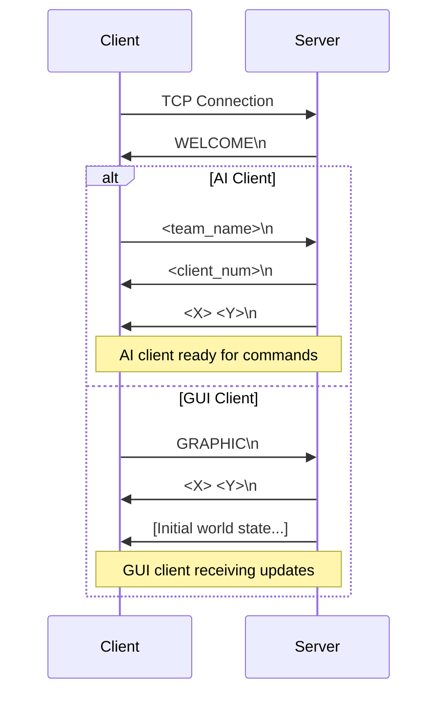

# Zappy Network Protocol

The Zappy network protocol is a custom TCP-based communication system that enables real-time interaction between the game server and various clients (AI players and GUI observers). This document provides a comprehensive specification of the protocol implementation.

## 📋 Protocol Overview

### Design Principles

- **Text-Based**: Human-readable commands for easy debugging and development
- **Stateful**: Maintains connection state and player context
- **Extensible**: Designed to support new commands and features
- **Real-time**: Optimized for low-latency gaming communication
- **Reliable**: TCP-based for guaranteed message delivery

### Connection Types

The protocol supports two primary client types:

1. **AI Clients** - Autonomous players that control game entities
2. **GUI Clients** - Visualization tools that observe the game state

## 🔌 Connection Flow

### Initial Handshake

All clients follow the same initial connection sequence:



### Connection Examples

<!-- tabs:start -->

#### **AI Client Connection**
```
Client connects to server:4242
← WELCOME
→ TeamAlpha
← 3
← 10 10
// Now ready to send commands
→ Look
← [ player, food linemate, food, , , , , ]
```

#### **GUI Client Connection**
```
Client connects to server:4242
← WELCOME
→ GRAPHIC
← 10 10
← msz 10 10
← bct 0 0 1 0 2 0 0 0 0
← bct 0 1 0 1 0 1 0 0 0
... (full world state)
```

<!-- tabs:end -->

## 🎮 AI Client Protocol

### Command Structure

All AI client commands follow the format:
```
<command_name> [arguments]\n
```

Commands are processed asynchronously and may have different execution times.

### Player Commands

#### Movement Commands

| Command | Time Cost | Description | Response |
|---------|-----------|-------------|----------|
| `Forward` | 7 | Move one tile forward | `ok` or `ko` |
| `Right` | 7 | Turn 90° clockwise | `ok` |
| `Left` | 7 | Turn 90° counter-clockwise | `ok` |

**Examples:**
```
→ Forward
← ok

→ Right  
← ok

→ Left
← ok
```

#### Perception Commands

| Command | Time Cost | Description | Response Format |
|---------|-----------|-------------|-----------------|
| `Look` | 7 | Get vision of surrounding area | `[ <content> ]` |
| `Inventory` | 1 | Get current inventory | `[ <resources> ]` |

**Look Command:**
```
→ Look
← [ player food, linemate, food, , deraumere, , , , ]
```

The look response represents the player's field of view in a specific pattern:
```
Level 1 vision (distance-based):
     0
   1 2 3
 4 5 P 6 7
   8 9 10
    11
```

**Inventory Command:**
```
→ Inventory  
← [ food 5, linemate 2, deraumere 0, sibur 1, mendiane 0, phiras 0, thystame 0 ]
```

#### Resource Commands

| Command | Time Cost | Description | Response |
|---------|-----------|-------------|----------|
| `Take <object>` | 7 | Pick up specified object | `ok` or `ko` |
| `Set <object>` | 7 | Drop specified object | `ok` or `ko` |

**Examples:**
```
→ Take food
← ok

→ Set linemate
← ok

→ Take nonexistent  
← ko
```

#### Communication Commands

| Command | Time Cost | Description | Response Format |
|---------|-----------|-------------|-----------------|
| `Broadcast <text>` | 7 | Send message to all team members | `ok` |
| `Connect_nbr` | 0 | Get number of unused team slots | `<number>` |

**Broadcast:**
```
→ Broadcast Hello team!
← ok

// Other team members receive:
← message <direction>, Hello team!
```

Direction indicates the relative direction of the broadcaster:
- `0`: Same tile
- `1-8`: Compass directions (1=N, 2=NE, 3=E, etc.)

#### Advanced Commands

| Command | Time Cost | Description | Response |
|---------|-----------|-------------|----------|
| `Fork` | 42 | Lay an egg | `ok` |
| `Eject` | 7 | Eject all players from current tile | `ok` or `ko` |
| `Incantation` | 300 | Start elevation ritual | `Elevation underway` or `ko` |

**Incantation Process:**
```
→ Incantation
← Elevation underway

// If successful (after 300 time units):
← Current level: 2

// If failed:
← ko
```

### Server Notifications

The server sends asynchronous notifications to players:

| Notification | Description | Format |
|--------------|-------------|--------|
| `dead` | Player has died | `dead` |
| `message <K>, <text>` | Broadcast received | `message 3, Hello!` |
| `Elevation underway` | Elevation started | `Elevation underway` |
| `Current level: <L>` | Level changed | `Current level: 3` |

## 🎨 GUI Client Protocol

### Graphics Protocol Commands

GUI clients receive detailed world state information:

#### World Structure

| Command | Description | Format |
|---------|-------------|--------|
| `msz` | Map size | `msz <X> <Y>` |
| `bct` | Tile content | `bct <X> <Y> <food> <linemate> <deraumere> <sibur> <mendiane> <phiras> <thystame>` |
| `tna` | Team names | `tna <team_name>` |

#### Player Information

| Command | Description | Format |
|---------|-------------|--------|
| `pnw` | New player | `pnw <player_id> <X> <Y> <orientation> <level> <team_name>` |
| `ppo` | Player position | `ppo <player_id> <X> <Y> <orientation>` |
| `plv` | Player level | `plv <player_id> <level>` |
| `pin` | Player inventory | `pin <player_id> <X> <Y> <food> <linemate> <deraumere> <sibur> <mendiane> <phiras> <thystame>` |
| `pex` | Player expulsion | `pex <player_id>` |
| `pbc` | Player broadcast | `pbc <player_id> <message>` |
| `pic` | Incantation start | `pic <X> <Y> <level> <player_id> [<player_id> ...]` |
| `pie` | Incantation end | `pie <X> <Y> <result>` |
| `pfk` | Player fork | `pfk <player_id>` |
| `pdr` | Player drops resource | `pdr <player_id> <resource_id>` |
| `pgt` | Player takes resource | `pgt <player_id> <resource_id>` |
| `pdi` | Player death | `pdi <player_id>` |

#### Eggs

| Command | Description | Format |
|---------|-------------|--------|
| `enw` | New egg | `enw <egg_id> <player_id> <X> <Y>` |
| `eht` | Egg hatching | `eht <egg_id>` |
| `ebo` | Player connection to egg | `ebo <egg_id>` |
| `edi` | Egg death | `edi <egg_id>` |

#### Game Events

| Command | Description | Format |
|---------|-------------|--------|
| `sgt` | Server time | `sgt <time>` |
| `sst` | Server time modification | `sst <time>` |
| `seg` | End of game | `seg <team_name>` |
| `smg` | Server message | `smg <message>` |
| `suc` | Unknown command | `suc` |
| `sbp` | Bad parameter | `sbp` |

### GUI Example Session

```
← WELCOME
→ GRAPHIC
← 10 10
← msz 10 10
← tna TeamAlpha
← tna TeamBeta
← bct 0 0 1 0 2 0 0 0 0
← bct 0 1 0 1 0 1 0 0 0
... (all tiles)
← pnw 1 5 5 1 1 TeamAlpha
← pnw 2 3 7 2 1 TeamBeta
← sgt 100
... (real-time updates)
← ppo 1 5 6 1
← pgt 1 0
← pin 1 5 6 4 1 0 0 0 0 0
```

## ⚙️ Protocol Implementation

### Message Format

All protocol messages are text-based and terminated with `\n`:

```
<command> [<param1> [<param2> [...]]] \n
```

### Error Handling

The protocol includes several error responses:

| Error | Condition | Response |
|-------|-----------|----------|
| `ko` | Invalid command or action | `ko` |
| `suc` | Unknown command | `suc` |
| `sbp` | Bad parameter format | `sbp` |

### Timing System

Commands have associated time costs measured in time units:

- **Time Unit**: Basic unit of game time (1/frequency seconds)
- **Frequency**: Server parameter controlling game speed
- **Queuing**: Commands are queued and executed after their time cost

Example with frequency 100:
- 1 time unit = 0.01 seconds
- `Forward` (cost 7) = 0.07 seconds
- `Incantation` (cost 300) = 3.0 seconds

### Connection Management

#### Client States

1. **Connected**: TCP connection established
2. **Welcomed**: Received WELCOME message
3. **Authenticated**: Team selected (AI) or GRAPHIC sent (GUI)
4. **Active**: Receiving commands/updates

#### Disconnection Handling

- **Graceful**: Client sends disconnect or closes socket cleanly
- **Ungraceful**: Server detects broken connection and cleans up
- **Timeout**: Server may implement timeouts for inactive clients

## 🔧 Implementation Guidelines

### Client Implementation

```python
class ZappyClient:
    def __init__(self, host, port):
        self.socket = socket.socket(socket.AF_INET, socket.SOCK_STREAM)
        self.socket.connect((host, port))
        self.buffer = ""
        
    def send_command(self, command):
        message = f"{command}\n"
        self.socket.send(message.encode())
        
    def receive_response(self):
        while '\n' not in self.buffer:
            data = self.socket.recv(1024).decode()
            if not data:
                raise ConnectionError("Server disconnected")
            self.buffer += data
            
        line, self.buffer = self.buffer.split('\n', 1)
        return line.strip()
```

### Server Implementation Considerations

```c
typedef struct client_s {
    int fd;
    int team_id;
    int player_id;
    char *buffer;
    size_t buffer_size;
    client_type_t type;  // AI or GRAPHIC
    command_queue_t *pending_commands;
} client_t;

// Non-blocking I/O with poll()
int handle_clients(server_t *server) {
    struct pollfd *fds = create_poll_array(server);
    int ready = poll(fds, server->client_count + 1, 0);
    
    if (ready > 0) {
        handle_new_connections(server, fds);
        handle_client_data(server, fds);
        handle_client_disconnections(server, fds);
    }
    
    return ready;
}
```

## 🧪 Testing & Debugging

### Protocol Testing

Use telnet or netcat for manual protocol testing:

```bash
# Connect as AI client
$ telnet localhost 4242
WELCOME
TeamTest
3
10 10
Look
[ , , , , ]
Inventory
[ food 10, linemate 0, deraumere 0, sibur 0, mendiane 0, phiras 0, thystame 0 ]
```

### Debug Tools

**Protocol Logger:**
```python
class ProtocolLogger:
    def log_message(self, direction, message):
        timestamp = time.strftime("%H:%M:%S.%f")[:-3]
        symbol = "→" if direction == "sent" else "←"
        print(f"[{timestamp}] {symbol} {message}")
```

**Message Validator:**
```python
def validate_command(command):
    valid_commands = {
        'Forward': 0, 'Right': 0, 'Left': 0,
        'Look': 0, 'Inventory': 0,
        'Take': 1, 'Set': 1,
        'Broadcast': 1, 'Connect_nbr': 0,
        'Fork': 0, 'Eject': 0, 'Incantation': 0
    }
    
    parts = command.split()
    cmd_name = parts[0]
    
    if cmd_name not in valid_commands:
        return False, "Unknown command"
    
    expected_args = valid_commands[cmd_name]
    if len(parts) - 1 != expected_args:
        return False, f"Expected {expected_args} arguments"
    
    return True, "Valid"
```

## 📊 Protocol Extensions

### Custom Commands

The protocol can be extended with custom commands:

```c
// Custom command structure
typedef struct custom_command_s {
    char *name;
    int (*handler)(client_t *client, char **args);
    int time_cost;
    bool requires_authentication;
} custom_command_t;

// Register custom command
void register_custom_command(server_t *server, custom_command_t *cmd) {
    add_command_to_dispatcher(server->cmd_dispatcher, cmd);
}
```

### Future Enhancements

Potential protocol improvements:

- **Binary Mode**: Optional binary protocol for performance
- **Compression**: Message compression for large worlds  
- **Authentication**: Secure client authentication system
- **Versioning**: Protocol version negotiation
- **Streaming**: Continuous state streaming for GUI clients

## 🔗 Related Documentation

- **[Server Implementation](../server/README.md)** - Server-side protocol handling
- **[AI Client](../ai/README.md)** - AI client protocol usage
- **[GUI Client](../gui/README.md)** - GUI client implementation
- **[Command Reference](commands.md)** - Complete command documentation
- **[Message Format](messages.md)** - Detailed message specifications

---

The Zappy protocol provides a robust foundation for real-time multiplayer gaming communication, balancing simplicity with functionality to enable rich gameplay experiences while maintaining excellent debuggability and extensibility.
