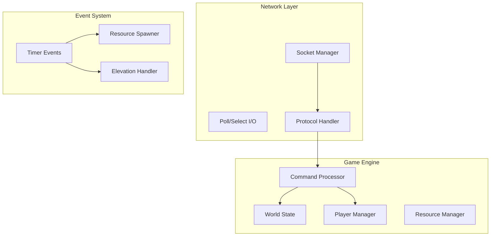

# Zappy Server

The Zappy server is the core component that manages the game world, processes player actions, and maintains the game state. Built in C with performance and reliability in mind, it handles multiple concurrent connections using non-blocking I/O.

## 🏗️ Architecture Overview

The server follows a modular architecture with clear separation of concerns:



## 🎮 Core Features

### Multi-Client Support
- **Concurrent Connections**: Handles multiple AI clients and GUI clients simultaneously
- **Non-blocking I/O**: Uses `poll()` or `select()` for efficient connection management
- **Connection Pooling**: Manages client connections with proper cleanup

### Game World Simulation
- **Toroidal Map**: Seamless edge wrapping for unique spatial mechanics
- **Resource Management**: Dynamic spawning and collection of game resources
- **Time Management**: Precise timing control with configurable frequency

### Protocol Implementation
- **Text-based Protocol**: Human-readable commands for easy debugging
- **Command Validation**: Robust input validation and error handling
- **State Synchronization**: Keeps all clients synchronized with game state

## 🔧 Configuration

### Command Line Arguments

The server accepts the following command-line arguments:

```bash
./zappy_server -p port -x width -y height -n name1 name2 ... -c clientsNb -f freq
```

| Argument | Description | Required | Example |
|----------|-------------|----------|---------|
| `-p port` | Server port number | ✅ | `-p 4242` |
| `-x width` | Map width | ✅ | `-x 10` |
| `-y height` | Map height | ✅ | `-y 10` |
| `-n name1 name2 ...` | Team names | ✅ | `-n TeamA TeamB TeamC` |
| `-c clientsNb` | Max clients per team | ✅ | `-c 3` |
| `-f freq` | Time frequency | ✅ | `-f 100` |

### Configuration Examples

<!-- tabs:start -->

#### **Small Game**
```bash
./zappy_server -p 4242 -x 5 -y 5 -n Red Blue -c 2 -f 50
```
- Small 5x5 map
- 2 teams with max 2 players each
- Slower pace (50 freq)

#### **Standard Game**
```bash
./zappy_server -p 4242 -x 10 -y 10 -n TeamA TeamB TeamC -c 3 -f 100
```
- Standard 10x10 map  
- 3 teams with max 3 players each
- Normal pace (100 freq)

#### **Large Tournament**
```bash
./zappy_server -p 4242 -x 20 -y 20 -n Alpha Beta Gamma Delta -c 5 -f 200
```
- Large 20x20 map
- 4 teams with max 5 players each  
- Fast pace (200 freq)

<!-- tabs:end -->

## 🌐 Network Protocol

The server implements a custom TCP-based protocol for client communication.

### Connection Flow

1. **Client Connection**: Client connects to server socket
2. **Welcome Message**: Server sends `WELCOME\n`
3. **Team Selection**: Client sends team name
4. **Slot Assignment**: Server responds with available slots and map size
5. **Game Commands**: Client sends commands, server responds with results

### Protocol Messages

#### Server to Client
```
WELCOME\n                    # Initial greeting
<nb>\n                      # Available team slots
<X> <Y>\n                   # Map dimensions
ok\n                        # Command success
ko\n                        # Command failure
dead\n                      # Player death
<content>\n                 # Command response
```

#### Client to Server
```
<team_name>\n               # Team selection
GRAPHIC\n                   # GUI client identification
<command>\n                 # Game command
```

For detailed protocol specification, see [Protocol Documentation](../protocol.md).

## 🎯 Game Logic

### Resource Management

The server manages 7 types of resources that spawn randomly across the map:

| Resource | Spawn Rate | Purpose |
|----------|------------|---------|
| **food** | High | Player survival |
| **linemate** | Medium | Level 1-8 elevation |
| **deraumere** | Medium | Level 2-8 elevation |
| **sibur** | Medium | Level 2-8 elevation |
| **mendiane** | Low | Level 5-6 elevation |
| **phiras** | Low | Level 4-7 elevation |
| **thystame** | Rare | Level 7-8 elevation |

### Player Lifecycle

1. **Spawning**: Players spawn from team eggs at random locations
2. **Survival**: Must consume food every 126 time units or die
3. **Collection**: Gather resources needed for elevation
4. **Elevation**: Participate in team rituals to level up
5. **Reproduction**: Lay eggs to increase team size
6. **Victory**: Achieve level 8 as part of winning team

### Elevation System

Elevation requires specific resources and player counts:

```c
// Level 1 → 2
Requirements: 1 linemate, 1 player

// Level 2 → 3  
Requirements: 1 linemate, 1 deraumere, 1 sibur, 2 players

// Level 3 → 4
Requirements: 2 linemate, 1 sibur, 2 phiras, 2 players

// ... (see full table in game mechanics)
```

## 🔨 Implementation Details

### Core Data Structures

```c
typedef struct s_server {
    int                 socket_fd;
    int                 port;
    struct sockaddr_in  address;
    fd_set              read_fds;
    fd_set              write_fds;
    client_t            *clients;
    world_t             *world;
    team_t              *teams;
    int                 max_clients;
    int                 frequency;
} server_t;

typedef struct s_world {
    tile_t      **map;
    int         width;
    int         height;
    int         frequency;
    time_t      start_time;
} world_t;

typedef struct s_tile {
    int         food;
    int         linemate;
    int         deraumere;
    int         sibur;
    int         mendiane;
    int         phiras;
    int         thystame;
    player_t    *players;
} tile_t;
```

### Command Processing

The server processes commands through a dispatcher pattern:

```c
typedef struct s_command {
    char        *name;
    int         (*handler)(client_t *client, char **args);
    int         time_cost;
    bool        requires_auth;
} command_t;

command_t commands[] = {
    {"Forward", cmd_forward, 7, true},
    {"Right", cmd_right, 7, true},
    {"Left", cmd_left, 7, true},
    {"Look", cmd_look, 7, true},
    {"Inventory", cmd_inventory, 1, true},
    {"Broadcast", cmd_broadcast, 7, true},
    {"Connect_nbr", cmd_connect_nbr, 0, true},
    {"Fork", cmd_fork, 42, true},
    {"Eject", cmd_eject, 7, true},
    {"Take", cmd_take, 7, true},
    {"Set", cmd_set, 7, true},
    {"Incantation", cmd_incantation, 300, true},
    {NULL, NULL, 0, false}
};
```

### Event System

The server uses a timer-based event system for:

- **Resource Spawning**: New resources appear at regular intervals
- **Player Actions**: Commands execute after their time cost
- **Food Consumption**: Players consume food every 126 time units
- **Egg Hatching**: Team eggs hatch into new players

## 🧪 Testing

### Unit Tests

Run the server test suite:

```bash
cd server/test
make test
./test_server
```

### Integration Tests

Test with multiple clients:

```bash
# Terminal 1: Start server
./zappy_server -p 4242 -x 5 -y 5 -n Test -c 2 -f 100

# Terminal 2: Connect client 1
echo -e "Test\nInventory\n" | nc localhost 4242

# Terminal 3: Connect client 2  
echo -e "Test\nLook\n" | nc localhost 4242
```

### Load Testing

Stress test with many connections:

```bash
# Create 100 concurrent connections
for i in {1..100}; do
    (echo -e "Test\nInventory\n" | nc localhost 4242) &
done
wait
```

## 🐛 Debugging

### Debug Build

Compile with debug symbols:

```bash
cd build
cmake -DCMAKE_BUILD_TYPE=Debug ..
make
```

### GDB Debugging

```bash
gdb ./zappy_server
(gdb) run -p 4242 -x 5 -y 5 -n Test -c 1 -f 100
(gdb) bt  # Show backtrace on crash
```

### Valgrind Memory Check

```bash
valgrind --leak-check=full ./zappy_server -p 4242 -x 5 -y 5 -n Test -c 1 -f 100
```

### Logging

Enable verbose logging:

```bash
./zappy_server -p 4242 -x 5 -y 5 -n Test -c 1 -f 100 -v
```

## 📊 Performance

### Benchmarks

Typical performance metrics:

- **Concurrent Clients**: 100+ simultaneous connections
- **Command Throughput**: 1000+ commands per second  
- **Memory Usage**: ~10MB base + ~1KB per client
- **CPU Usage**: <5% on modern hardware for standard games

### Optimization Tips

1. **Frequency Tuning**: Lower frequency for better performance
2. **Map Size**: Smaller maps reduce computation overhead
3. **Client Limits**: Reasonable client limits prevent resource exhaustion
4. **Resource Spawning**: Adjust spawn rates for balance vs performance

## 🚀 Advanced Usage

### Custom Game Modes

Modify the source code to create custom game modes:

```c
// Custom elevation requirements
static const elevation_t custom_levels[] = {
    {2, {{LINEMATE, 2}, {FOOD, 10}}},  // Custom level 2
    {3, {{LINEMATE, 3}, {DERAUMERE, 2}}},  // Custom level 3
    // ...
};
```

### Plugin System

The server supports loadable modules for:

- Custom commands
- Modified game rules  
- Event handlers
- Resource behaviors

### Monitoring

Integrate with monitoring systems:

```bash
# Export metrics to statsd
./zappy_server -p 4242 ... --statsd-host metrics.example.com:8125

# Log to syslog
./zappy_server -p 4242 ... --syslog
```

## 🔗 Related Documentation

- **[Network Protocol](../protocol.md)** - Detailed protocol specification
- **[Commands Reference](../protocol/commands.md)** - All available commands
- **[Architecture Overview](../architecture.md)** - System-wide design
- **[GUI Client](../gui/README.md)** - Visual client documentation
- **[AI Client](../ai/README.md)** - Autonomous client documentation

---

The Zappy server provides a robust foundation for the multiplayer game experience. Its modular design and comprehensive feature set make it suitable for both casual games and competitive tournaments.
